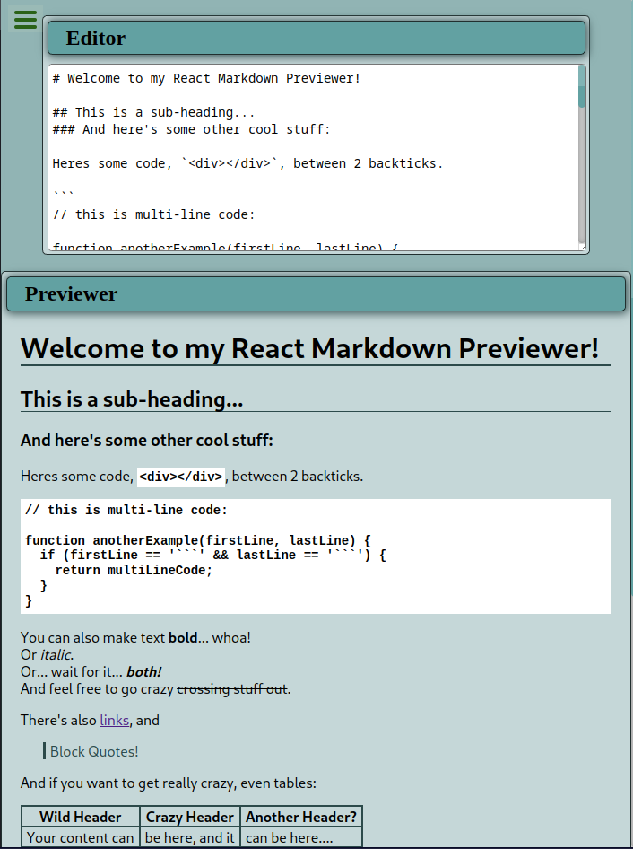

# **Markdown Previewer**

> App edit and previsualize your markdowns

Available live [here](https://fernet87.github.io/markdown-previewer/) 

## About the Project

<p align="center">
  
</p>

This is a React based app to Build the Markdown Previewer for [freeCodeCamp](https://www.freecodecamp.org/learn/front-end-development-libraries/front-end-development-libraries-projects/build-a-markdown-previewer) Front End Development Libraries project.
In this app you have an editing panel in which you can write your markdown code and it will be interpreted and shown in a preview panel.

Read more about [Markdown](https://en.wikipedia.org/wiki/Markdown)

## **Technologies used for this project.**

[](https://html.spec.whatwg.org/multipage/) [](https://www.css3.com/) [](https://developer.mozilla.org/en-US/docs/Web/JavaScript)
[](https://reactjs.org/) [](https://redux.js.org/) [](https://sass-lang.com/) [](https://marked.js.org)

### **How to start project**

Install project dependecies:

```
npm install
```

Start the web server

```
npm start
```
